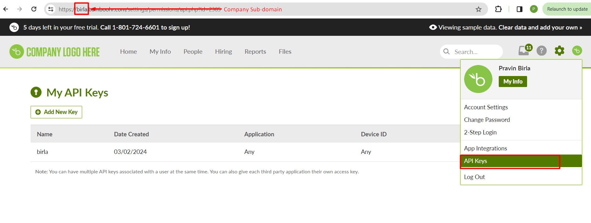

# Introduction
Here is the Technical Integration Assignment from Pravin Birla 😃

# Setup Guide
- Clone the project.
- Run following commands in the terminal:
- Create `.env` file in root folder, WIth properties defined in `.env-example`.
```bash
npm install
npm start
``` 
- Then use url to get data `http://{HOST}:{PORT}/api/employees/{id}`

# Pre-requisite
- Install Node.js, version >= 18
- Bamboohr Account > API Key and Company sub-domain



- [BambooHR API Reference Documentation](https://documentation.bamboohr.com/reference/get-employee)
